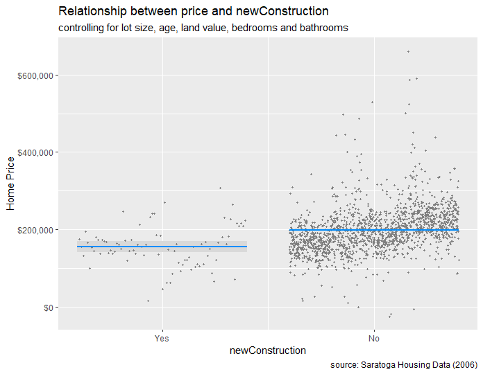

# Causalidad SaratogaHouses

En sste script muestro un analisis de causalidad en el precio de la vivienda en funcion de variables como tamaño del lote, antiguedad de la vivienda, valor del terreno entre otras variables. La realización de modelos tiene el objetivo de simplificar la realidad para poder entender mejor la relación entre los fenómenos que ocurren, un modelo téorico seria:
Υi =    β0  + βi.Xi+ µi
El data set es SaratogaHouses perteneciente al package="mosaicData".
Como es sabido, en economía/econometría se utiliza el método de minimos cuadrados ordinarios para encontrar los parametros poblacionales en un método de regresión lineal. Este método minimiza la suma de las distancias verticales entre las respuestas observadas en la muestra y la respuesta del modelo.

El método MCO, siempre y cuando se cumplan los supuestos clave, será consistente cuando los regresores sean exógenos y no haya perfecta multicolinealidad (situación en la que se presenta una fuerte correlación entre variables explicativas del modelo), este será óptimo en la clase de parámetros lineales cuando los errores sean homocedásticos y además no haya autocorrelación. En el lenguaje comunmente hablado, decimos que los errores deben comportarse ¨bien¨, ser aleatorios, en su defecto estariamos incurriendo en algun tipo de mala especificación del modelo. En estas condiciones, el método de MCO proporciona un estimador insesgado de varianza mínima siempre que los errores tengan varianzas finitas. Bajo la suposición adicional de que los errores se distribuyen normalmente, el estimador MCO es el de máxima verosimilitud. 

Desde mi punto de vista, con el surguimiento masivo de datos, tuvo lugar por parte de muchos profesionales o entusiastas que no contaban con un profuso conocimiento de estadistica o econometria, una redenominación de muchos conceptos que en el ambito de la econometría ya se encontraban definidos. Esto puede dar lugar a malentendios o confusión en este campo de analisis. 

El aprendizaje supervisado en un area de la inteligencia artifical, que su principal caracteristica es el establecer modelos donde exista una variable/es independiente/es y otra dependiente. Esta última encarna el fenomeno que quiero explicar a traves de regresores (las variables independientes). En tal sentido el precio de un inmueble lo podria explicar a traves de distintas variables, por ejemplo: Los metros cuadrados del inmueble, si tiene o no vista al mar, el año de contrucción y asi sucesivamente.

La otra area dentro del aprendizaje supervisado seria poder clasificar, por ejemplo, quiero saber que manzanas cumplen los estandares de calidad para ser exportadas. En este ambito la variable 

